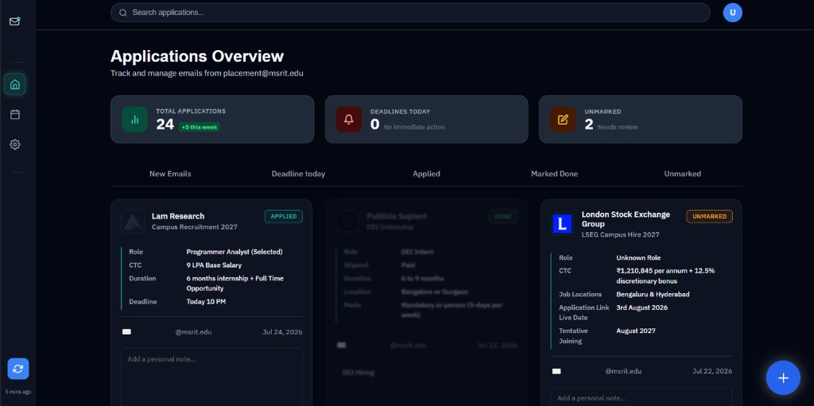
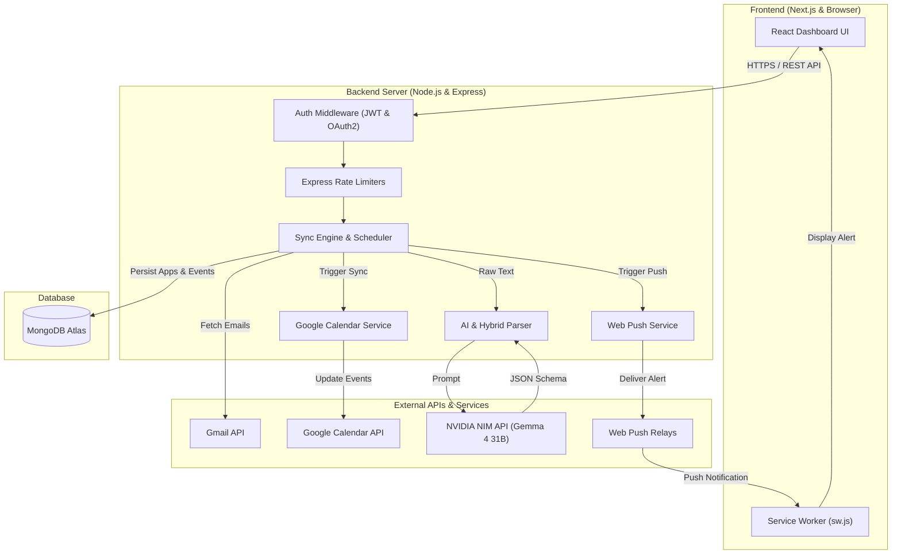
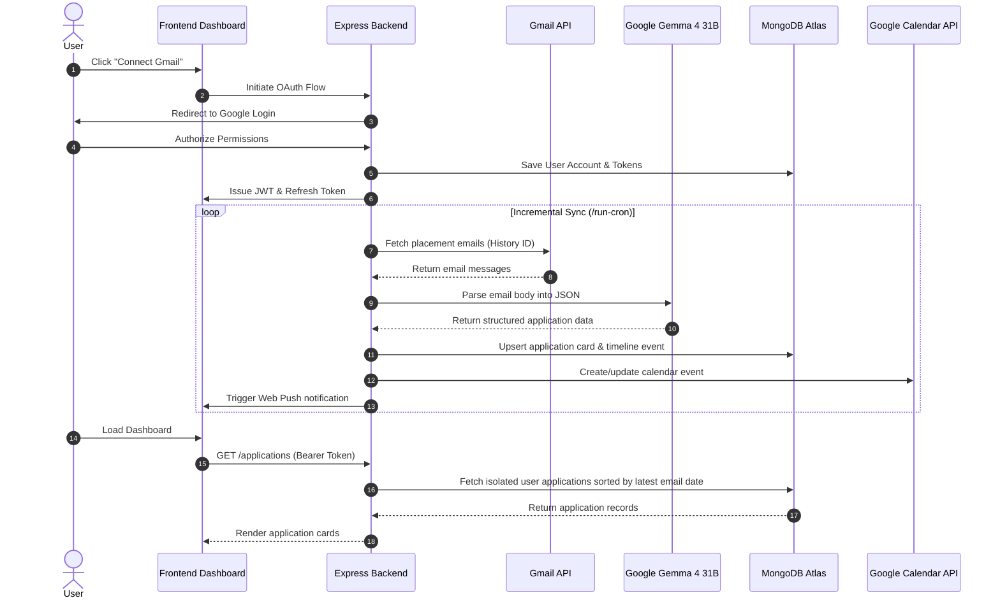

# Email Tracker

[](https://nextjs.org/)
[](https://nodejs.org/)
[](https://expressjs.com/)
[](https://www.mongodb.com/)
[](https://cloud.google.com/)
[](https://email-tracker-seven-rho.vercel.app/)

---

## Project Description

Email Tracker is a multi-user web application that automatically organizes placement-related Gmail emails into a centralized dashboard. It uses Google OAuth for secure authentication, AI-powered email parsing with deterministic fallbacks, incremental Gmail synchronization, Google Calendar integration, and Web Push notifications to help students never miss recruitment deadlines.

---

## Screenshots



---

## Features

### Email Ingestion & AI Parsing
- **Automated Extraction:** Converts unstructured email content into structured application details, including company name, role, stipend, location, links, duration, and required skills.
- **Reliable Fallbacks:** Uses pattern matching to ensure data extraction continues smoothly even if API limits are reached.
- **Company Normalization:** Standardizes company names and displays matching logos automatically.

### Multiuser Data Isolation
- **OAuth Authentication:** Connects users via Google OAuth with minimal read-only Gmail and Calendar permissions.
- **Per-User Isolation:** Ensures every user only sees their own emails, applications, and calendar events.

### Google Calendar Events
- **Deadline Synchronization:** Automatically adds and updates deadlines, interview schedules, online assessments, and talk sessions on the user's Google Calendar.
- **Smart Change Detection:** Avoids duplicate calendar events and unnecessary API calls when updates occur.

### Web Push Notifications
- **Instant Browser Alerts:** Sends real-time notifications to user devices for critical deadlines, assessment links, and interview updates using Service Workers.
- **Priority Alerts:** Categorizes notifications based on event importance.

### Dashboard & Timeline Tracking
- **Unified Timeline:** Groups follow-up emails for the same company under a single application card to display communication history sequentially.
- **Activity-Based Sorting:** Sorts application cards automatically by the date of the most recent email received.
- **Status Workflow:** Moves applications through stages such as New, Unmarked, Applied, and Done.
- **Custom Overrides:** Allows manual editing of application details while preserving manual choices during future syncs.

---

## Tech Stack

| Layer | Technologies Used |
|---|---|
| **Frontend** | Next.js, React, CSS Modules / Design System, Service Workers |
| **Backend** | Node.js, Express.js, Mongoose ODM |
| **Database** | MongoDB Atlas |
| **Authentication & Security** | Google OAuth 2.0, JWT, Express Rate Limit |
| **AI & LLM** | Google Gemma 4 31B (NVIDIA NIM API) |
| **External APIs** | Gmail API, Google Calendar API, Web Push API |
| **Deployment** | Vercel (Frontend) |

---

## Architecture Diagram



---

## Project Structure

```text
email-tracker/
├── backend/
│   ├── config/
│   │   └── appConfig.js            # Email domain allowlists & settings
│   ├── middleware/
│   │   ├── authenticate.js         # JWT authentication middleware
│   │   └── rateLimiters.js         # Rate limiting configurations
│   ├── models/
│   │   ├── Account.js              # User account & token schema
│   │   ├── Application.js          # Application & event timeline schema
│   │   └── CompanyInfo.js          # Shared company metadata & logo cache
│   ├── routes/
│   │   └── applicationRoutes.js    # Application REST endpoints
│   ├── utils/
│   │   ├── authCodeStore.js        # Authentication code helper
│   │   ├── calendarService.js      # Google Calendar synchronization
│   │   ├── companyInfoService.js   # Company logo fetcher
│   │   ├── jwt.js                  # Token utilities & hashing
│   │   ├── normalizeCompany.js     # Company name normalizer
│   │   ├── parseEmailWithLLM.js    # AI email parser & fallbacks
│   │   ├── pushService.js          # Web Push notification dispatcher
│   │   └── statusMachine.js        # Application status logic
│   ├── package.json
│   └── server.js                   # Express server entry point
│
├── frontend/
│   ├── app/
│   │   ├── privacy/page.js         # Privacy Policy page
│   │   ├── terms/page.js           # Terms of Service page
│   │   ├── utils/pushManager.js    # Web Push subscription helper
│   │   ├── layout.js               # Root Layout
│   │   └── page.js                 # Main Dashboard view
│   ├── public/
│   │   ├── dashboard-preview.png   # Dashboard preview image
│   │   ├── manifest.json           # Web App Manifest
│   │   └── sw.js                   # Service Worker implementation
│   ├── next.config.mjs
│   └── package.json
│
├── docs/
│   └── dashboard-preview.png       # Documentation preview image
└── README.md
```

---

## Installation

### Prerequisites
- **Node.js**: v18.0.0 or higher
- **npm**: v9.0.0 or higher
- **MongoDB**: Local instance or MongoDB Atlas account
- **Google Cloud Console Project**: OAuth 2.0 Client ID with **Gmail API** and **Google Calendar API** enabled

---

### Step-by-Step Setup

1. **Clone the Repository:**
   ```bash
   git clone https://github.com/tejasholla23/email-tracker.git
   cd email-tracker
   ```

2. **Backend Setup:**
   ```bash
   cd backend
   npm install
   ```

3. **Frontend Setup:**
   ```bash
   cd ../frontend
   npm install
   ```

---

## Environment Variables

### Required Backend Environment Variables (`backend/.env`)

Create a `.env` file in `backend/`:

```env
# Server Configuration
PORT=5000
FRONTEND_URL=http://localhost:3000

# Database
MONGO_URI=mongodb+srv://<username>:<password>@cluster.mongodb.net/email-tracker?retryWrites=true&w=majority

# JWT Security
JWT_SECRET=your_jwt_secret_key

# Google OAuth 2.0
GOOGLE_CLIENT_ID=your_google_client_id.apps.googleusercontent.com
GOOGLE_CLIENT_SECRET=your_google_client_secret
GOOGLE_REDIRECT_URI=http://localhost:5000/auth/google/callback

# NVIDIA NIM API (Google Gemma 4 31B)
NVIDIA_API_KEY=nvapi-your_nvidia_nim_api_key
NVIDIA_MODEL=google/gemma-4-31b-it

# Web Push VAPID Keys
VAPID_SUBJECT=mailto:admin@example.com
VAPID_PUBLIC_KEY=your_vapid_public_key
VAPID_PRIVATE_KEY=your_vapid_private_key

# External Cron Key
CRON_API_KEY=your_cron_secret_api_key
```

### Required Frontend Environment Variables (`frontend/.env.local`)

Create a `.env.local` file in `frontend/`:

```env
NEXT_PUBLIC_API_URL=http://localhost:5000
NEXT_PUBLIC_VAPID_PUBLIC_KEY=your_vapid_public_key
```

---

## How It Works



---

## Deployment

### Frontend (Vercel)
The frontend is hosted live on Vercel:
- **Live Demo:** [https://email-tracker-seven-rho.vercel.app/](https://email-tracker-seven-rho.vercel.app/)

### Backend Deployment
- Deploy the `backend/` directory to your preferred Node.js hosting platform (such as Render, Railway, or AWS).
- Set `FRONTEND_URL` to `https://email-tracker-seven-rho.vercel.app`.
- Update `GOOGLE_REDIRECT_URI` in Google Cloud Console to match your production backend URL.
- Use a periodic cron trigger (e.g., cron-job.org) pointing to `GET https://<your-backend-domain>/run-cron?cron_key=<CRON_API_KEY>` to run background synchronization.

---

## Security & Implementation Details

- **Google OAuth 2.0 Flow:** Tokens are acquired and stored securely server-side.
- **Refresh Token Rotation:** Access tokens are short-lived. Refresh tokens are hashed using SHA-256 before storage in MongoDB and rotated on every refresh call.
- **Query-Level Data Isolation:** Every database operation scopes queries with `{ userId: req.userId }` to ensure complete tenant separation.
- **Smart Calendar Syncing:** Uses SHA-256 fingerprinting for event deduplication and MD5 payload hashing to prevent redundant Google Calendar API updates.
- **VAPID Web Push:** Secures notification transmission using VAPID key pairs and background Service Workers.
- **Rate Limiting:** Protects endpoints against abuse using `express-rate-limit` middleware across auth, sync, read, and write operations.
