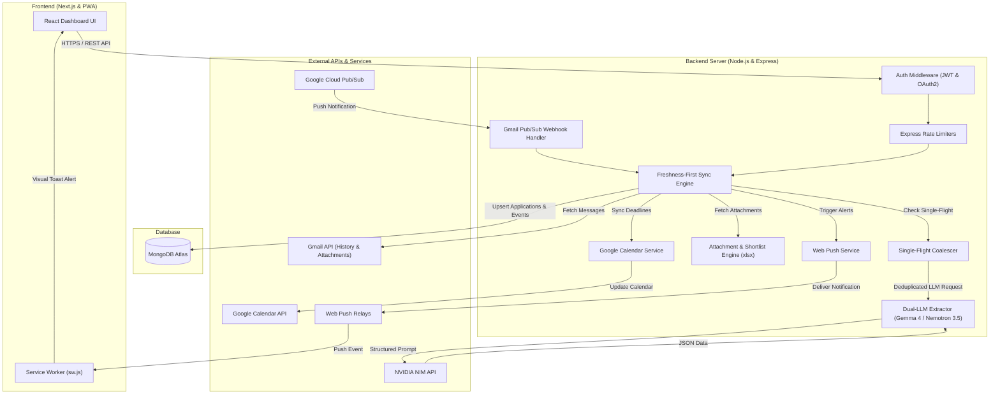

# Email Tracker

[](https://nextjs.org/)
[](https://nodejs.org/)
[](https://expressjs.com/)
[](https://www.mongodb.com/)
[](https://cloud.google.com/)
[](https://email-tracker-seven-rho.vercel.app/)

> **Live Application:** [https://email-tracker-seven-rho.vercel.app/](https://email-tracker-seven-rho.vercel.app/)

---

## Overview

**Email Tracker** is a production-grade, multi-user web application designed to automatically track, parse, and organize campus placement communications into a sleek, centralized dashboard.

Powered by a **Pure Dual-LLM Ingestion Pipeline** (Google Gemma 4 31B + NVIDIA Nemotron 3.5 Lightning), **Google Pub/Sub real-time webhooks**, **Linked Gmail accounts**, **Spreadsheet Shortlist Parsing**, **Google Calendar auto-synchronization**, and **Web Push alerts**, Email Tracker ensures students never miss a registration deadline, test announcement, or shortlist update.

---

## Screenshots


---

## Key Features

### 1. Pure Dual-LLM Ingestion & In-Flight Coalescing
- **Primary & Fallback Models:** Employs **Google Gemma 4 31B** as the primary structured extractor with automatic fallback to **NVIDIA Nemotron 3.5 Lightning** via NVIDIA NIM API.
- **Single-Flight Coalescing:** When hundreds of students receive the same placement broadcast simultaneously, the backend coalesces concurrent parses into **exactly one LLM request**, caching the structured result by `Message-ID` across all users in milliseconds.
- **Structured Schema Extraction:** Accurately extracts company name, role, CTC, stipend, location, deadline, eligibility criteria, registration links, and interview rounds without brittle regex guessing.

### 2. Bounded Persistent Retry Queue & Backoff
- **Freshness-First Guarantee:** Fresh inbox messages always take absolute priority.
- **Exponential Backoff Ladder:** Transient provider failures are deferred on an exponential schedule (+15m $\rightarrow$ +1h $\rightarrow$ +4h $\rightarrow$ +12h $\rightarrow$ +24h) with a maximum of 5 automated attempts.
- **Strict Budgeting:** Retries are bounded to at most 2 items per sync cycle, ensuring old retries never starve incoming placement emails.

### 3. Linked Gmail Accounts (Multi-Inbox Sync)
- **Unified Multi-Account Support:** Connect up to 3 secondary Google accounts (e.g., personal Gmail + college institutional email).
- **Independent Checkpoints:** Each linked inbox maintains isolated `historyId` tracking, token refresh management, and sender-level query filtering.

### 4. Attachment Ingestion & Spreadsheet Shortlist Detection
- **Multi-Attachment Support:** Automatically ingests and indexes attached JDs, schedules, and circulars (`.pdf`, `.xlsx`, `.xls`, `.csv`, images).
- **Automated Shortlist Matching:** Parses embedded Excel rosters and candidate lists using `xlsx`, matching against the student's configured Profile (Name, USN / Roll Number).
- **Visual Shortlist Badges:** Highlights whether the student is shortlisted directly on the event timeline card and triggers instant high-priority alerts.

### 5. Google Calendar Auto-Synchronization
- **Automatic Event Creation:** Synchronizes drive deadlines, PPTs, assessments, and interviews directly into the user's primary Google Calendar.
- **Idempotent Hashing:** Employs SHA-256 fingerprinting and MD5 payload diffing to prevent duplicate calendar entries and minimize external API calls.

### 6. Real-Time Push Notifications & Live Webhooks
- **Google Cloud Pub/Sub Webhooks:** Listens for instant mailbox changes via `/notifications/gmail` push endpoints.
- **Browser Push Notifications:** Delivers real-time notifications for critical deadlines, registration reminders, and shortlist results via Service Workers.

### 7. Unified Timeline & Application Management
- **Company Grouping:** Chronologically groups multiple emails from the same recruitment drive under a single interactive application card.
- **Workflow Stages:** Supports status transitions (`New`, `Applied`, `Interviewing`, `Offered`, `Rejected`, `Archived`).
- **Student Profile Management:** Allows users to configure target roles, USN/Roll Number, and degree info for personalized matching.

---

## Tech Stack

| Layer | Technologies Used |
|---|---|
| **Frontend** | Next.js 14, React, CSS Modules / CSS Variables Design System, Service Workers |
| **Backend** | Node.js, Express.js, Mongoose ODM |
| **Database** | MongoDB Atlas |
| **Authentication & Security** | Google OAuth 2.0 (PKCE), JWT Access/Refresh Rotation, Rate Limiters |
| **AI & LLM Pipeline** | Google Gemma 4 31B & NVIDIA Nemotron 3.5 Lightning (NVIDIA NIM API) |
| **Spreadsheet & Attachment Engine** | SheetJS (`xlsx`), Gmail Attachment API |
| **External APIs** | Gmail API (Push & History API), Google Calendar API, Web Push API |
| **Deployment** | Vercel (Frontend), Node.js Cloud Platform (Backend) |

---

## Architecture Diagram



---

## Project Structure

```text
email-tracker/
├── backend/
│   ├── config/
│   │   └── appConfig.js            # Configuration, models, and domain allowlists
│   ├── middleware/
│   │   ├── authenticate.js         # JWT verification & token rotation
│   │   └── rateLimiters.js         # Endpoint rate limiting
│   ├── models/
│   │   ├── Account.js              # User account, tokens & sync state
│   │   ├── LinkedGmailAccount.js   # Secondary linked Gmail accounts
│   │   ├── Application.js          # Applications, attachments & timeline events
│   │   └── CompanyInfo.js          # Shared company metadata & logo cache
│   ├── routes/
│   │   └── applicationRoutes.js    # REST endpoints for applications, sync & profile
│   ├── utils/
│   │   ├── attachmentUtils.js      # Attachment downloading & formatting
│   │   ├── calendarService.js      # Google Calendar synchronization & diffing
│   │   ├── companyInfoService.js   # Company logo & domain resolution
│   │   ├── gmailWatchService.js    # Gmail Pub/Sub watch renewal & verification
│   │   ├── jwt.js                  # JWT issuance & refresh token rotation
│   │   ├── normalizeCompany.js     # Company name canonicalization
│   │   ├── parseEmailWithLLM.js    # Pure Dual-LLM extraction & single-flight
│   │   ├── pushService.js          # Web Push notification dispatcher
│   │   ├── shortlistMatcher.js     # Excel/Spreadsheet applicant shortlist detection
│   │   └── statusMachine.js        # Application status transitions
│   ├── tests/                      # Comprehensive test suite (40+ automated tests)
│   ├── package.json
│   └── server.js                   # Express server, Pub/Sub webhook & cron engine
│
├── frontend/
│   ├── app/
│   │   ├── components/             # Reusable UI components
│   │   ├── offline/page.js         # Offline fallback page
│   │   ├── privacy/page.js         # Privacy Policy page
│   │   ├── terms/page.js           # Terms of Service page
│   │   ├── utils/pushManager.js    # Service worker push registration
│   │   ├── layout.js               # Root layout & meta tags
│   │   └── page.js                 # Main responsive dashboard
│   ├── public/
│   │   ├── dashboard-preview.png   # Dashboard preview asset
│   │   ├── manifest.json           # Web App Manifest (PWA)
│   │   └── sw.js                   # Web Push & Service Worker implementation
│   ├── next.config.mjs
│   └── package.json
└── README.md
```


---

## Deployment

### Frontend (Vercel)
- Live Deployment: **[https://email-tracker-seven-rho.vercel.app/](https://email-tracker-seven-rho.vercel.app/)**
- Connect your GitHub repository to Vercel and configure `NEXT_PUBLIC_API_URL` and `NEXT_PUBLIC_VAPID_PUBLIC_KEY`.

### Backend (Cloud / Container)
- Deploy `backend/` to your preferred cloud provider (Render, Railway, AWS ECS).
- Configure all environment variables in the provider dashboard.
- Set up an automated periodic cron (e.g. `cron-job.org` every 1 hour) hitting `GET https://<your-backend>/run-cron?cron_key=<CRON_API_KEY>` for backup maintenance syncs.
- Register your webhook URL `https://<your-backend>/notifications/gmail` as a push subscription in Google Cloud Pub/Sub.

---

## Security & Tenant Isolation

- **Scoped Tenant Isolation:** Every database operation is strictly scoped to `{ userId: req.userId }`.
- **SHA-256 Refresh Token Rotation:** Refresh tokens are hashed using SHA-256 before persistence and rotated on every authorization cycle.
- **Zero-Storage Attachment Processing:** Spreadsheet attachments for shortlist detection are parsed in-memory during sync and never stored as raw files on the host disk.
- **Minimal Permissions:** Connects via Google OAuth with minimal read-only Gmail access (`gmail.readonly`) and Calendar write scope (`calendar.events`).
- **Comprehensive Rate Limiting:** Tiered `express-rate-limit` guards against auth, read, write, and sync abuse.
